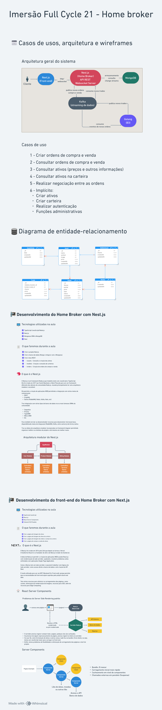

# Imersão Fullcycle 21 - Home broker

Participe gratuitamente: https://imersao.fullcycle.com.br/

## Requerimentos

Cada projeto tem seus próprios requerimentos, mas uma ferramenta é comum a todos: o Docker.

### Docker

Dependendo do seu sistema operacional, você tem 2 opções para instalar o Docker:

- [Docker Desktop] - Interface gráfica para gerenciar e usar o Docker.
- [Docker Engine] - Apenas a engine do Docker, sem interface gráfica, chamado de Docker Nativo.

Se você tem 8GB ou menos de memória RAM, recomendamos o uso do Docker Engine, pois a interface gráfica do Docker Desktop + a execução dos containers pode consumir praticamente a memória da máquina, caso contrário usar o Docker Desktop é mais prático.

Se você quiser saber mais detalhes sobre isto, veja nosso vídeo [https://www.youtube.com/watch?v=99dCerRKO6s](https://www.youtube.com/watch?v=99dCerRKO6s).

Se você estiver no Windows, use o WSL 2. Veja nosso tutorial [https://github.com/codeedu/wsl2-docker-quickstart](https://github.com/codeedu/wsl2-docker-quickstart).

## Rodar a aplicação

Ao final das aulas teremos todo o projeto, no momento estamos na aula 02 do Next.js, então, acesse as pastas **nestjs-api** e **next-frontend** e siga as instruções.

## Links e material adicional

* Como montar o melhor ambiente Dev no Windows, Linux e Mac com WSL [https://www.youtube.com/watch?v=O33trWxqVC4](https://www.youtube.com/watch?v=O33trWxqVC4)
* Instalação do Node.js [https://nodejs.org/](https://nodejs.org/)
* Docker [https://www.docker.com/](https://www.docker.com/)
* Tutorial do WSL + Docker [https://github.com/codeedu/wsl2-docker-quickstart]
* Minhas configurações do VSCode [https://github.com/argentinaluiz/my-vscode-settings](https://github.com/argentinaluiz/my-vscode-settings)

## Arquitetura do projeto

# Desafios

## API REST de ativos financeiros

Informações do desafio

Neste desafio, você deve criar uma aplicação Nest.js com Docker que rode na porta 3000. Esta aplicação precisa expor 2 rotas de API Rest:

* Listar assets - POST /api/assets
* Criar assets - GET /api/assets
* Criar orders - POST /api/orders
* Listar orders - GET /api/orders
  
Um asset tem os seguintes dados:
* id (é informado pelo usuário)
* symbol (símbolo do ativo)
  
Uma order tem os seguintes dados:
* id (automático do banco)
* asset_id (relacionado com Asset)
* price
* status (open, pending, closed) (não pode deixar mandar o status no POST)

Use o Mongoose, como nas aulas
Crie o arquivo api.http para fazer as chamadas HTTP. Ao rodar o docker compose up já precisa subir logo de cara o projeto com o Nest.js rodando + o MongoDB.
